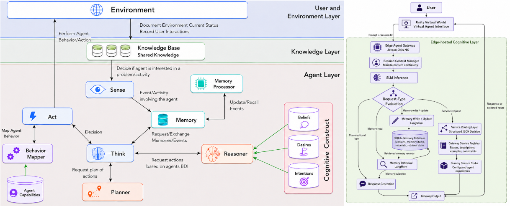

<h1 align="center">
  Enhancing Virtual Agents through SLMs and Edge Computing: 
  An Exploratory Evaluation of Think and Memory Processes
</h1>

  <strong><a href="https://www.uclancyprus.ac.cy/academic/dr-aimilios-hadjiliasi/">Aimilios Hadjiliasi</a></strong>*
  &emsp;&emsp;&emsp;&emsp;&emsp;
  <strong><a href="https://www.uclancyprus.ac.cy/academic/dr-louis-nisiotis/K">Louis Nisiotis</a></strong>*
   
  <a href="mailto:ahadjiliasi@uclan.ac.uk">ahadjiliasi@uclan.ac.uk</a>
  &emsp;&emsp;&emsp;&emsp;
  <a href="mailto:lnisiotis@uclan.ac.uk">lnisiotis@uclan.ac.uk</a>

  *<b>Department of Computing, Engineering and Mathematics 
    University of Central Lancashire, Cyprus</b>

  IEEE International Symposium on Mixed and Augmented Reality (ISMAR)  
  XRAG'26 - Agentic AI for Extented Reality
  (<a href="">XRAG'26</a>),
   

  

<h2 align="center"> Abstract </h2>

  Embodied intelligent virtual agents are expected to operate as persistent, adaptive, and context-aware entities within complex virtual Metaverse worlds. 
However, implementing cognitively capable agents in such environments is conceptually and technologically challenging. 
Among a range of blueprints and development approaches, the Cognitive Embodied Agent Architecture (CEAA) is an implementation-oriented framework for architecting components of perception, memory, reasoning, planning, and embodied action. Considering the recent advances in edge computing and generative AI language models, this paper explore the use of Small Language Models (SLMs) to support edge-based operation of selected CEAA components, focusing on <b>Think</b> and <b>Memory</b> as processes central to cognitive orchestration and persistence of virtual agents in interactive virtual worlds. 
An edge-based virtual agent gateway system was developed and evaluated on an NVIDIA Jetson Orin NX using Qwen2.5 models of different sizes, exploring the systems capability to process service requests and handle memory driven conversations. <b>Thinking</b> was examined through service routing, where the agent classifies user requests and selects the appropriate processing route, and <b>Memory</b> was examined through structured write--read interactions for storing, retrieving, and updating contextual information. A series of simulation experiments evaluated routing accuracy, memory-read performance, and latency demonstrating an SLM driven prototype agent system that partially operationalise selected CEAA processes, to support the development of embodied agents whose cognitive “brain” can operate efficiently and contextually for interactive experiences in immersive virtual worlds.

  <b>The files above include the csv files with the data used for evaluation along with the corresponding results</b>

